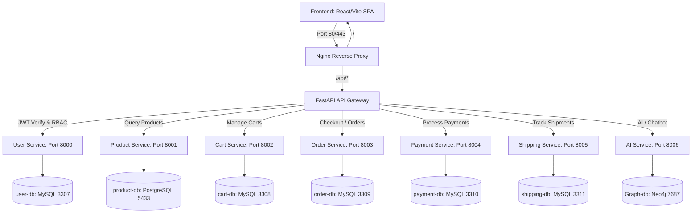

# QuickMall - Hệ thống E-Commerce Microservices & Trí tuệ Nhân tạo

## 📌 Giới thiệu hệ thống (Overview)
QuickMall là một nền tảng thương mại điện tử đa ngành quy mô lớn, được thiết kế theo kiến trúc **Microservices phân tán**. Dự án tích hợp các công nghệ phân tích dữ liệu và học sâu (AI Engine) để đề xuất sản phẩm cá nhân hóa và cung cấp Trợ lý tư vấn mua sắm thông minh (RAG Chatbot).

Hệ thống được phát triển với tinh thần **Database Isolation per Service** (mỗi dịch vụ quản lý một database riêng biệt, không chia sẻ database ở tầng vật lý) và giao tiếp đồng bộ hiệu năng cao qua Gateway API.

---

## 🛠️ Sơ đồ kiến trúc & Thành phần hệ thống (System Architecture)



### 1. Danh sách các dịch vụ & Trách nhiệm (Service Catalog)

1. **[gateway](file:///c:/Users/Admin/OneDrive%20-%20ptit.edu.vn/Desktop/SAD/ecom-final/gateway)**: API Gateway chạy FastAPI. Bảo mật JWT stateless, định tuyến động RBAC (`admin`, `staff`, `customer`). Được bao bọc bởi lớp **Nginx Reverse Proxy** ngoài cùng để gom cổng 80.
2. **[user-service](file:///c:/Users/Admin/OneDrive%20-%20ptit.edu.vn/Desktop/SAD/ecom-final/user-service)**: Django REST. Đăng ký, đăng nhập và phân phối JWT token.
3. **[product-service](file:///c:/Users/Admin/OneDrive%20-%20ptit.edu.vn/Desktop/SAD/ecom-final/product-service)**: Django REST. Quản lý kho hàng và thuộc tính đa hình cho 3 ngành hàng: Sách, Điện tử, Thời trang (mối quan hệ OneToOne).
4. **[cart-service](file:///c:/Users/Admin/OneDrive%20-%20ptit.edu.vn/Desktop/SAD/ecom-final/cart-service)**: Django REST. Quản lý sản phẩm được thêm vào giỏ hàng của từng khách hàng.
5. **[order-service](file:///c:/Users/Admin/OneDrive%20-%20ptit.edu.vn/Desktop/SAD/ecom-final/order-service)**: Django REST. Điều phối quy trình mua bán (Orchestrator). Nhận yêu cầu tạo đơn, gọi chéo API thanh toán và tạo vận đơn vận chuyển.
6. **[payment-service](file:///c:/Users/Admin/OneDrive%20-%20ptit.edu.vn/Desktop/SAD/ecom-final/payment-service)**: Django REST. Mô phỏng thanh toán qua tiền mặt (COD) hoặc tài khoản Ví điện tử.
7. **[shipping-service](file:///c:/Users/Admin/OneDrive%20-%20ptit.edu.vn/Desktop/SAD/ecom-final/shipping-service)**: Django REST. Quản lý vận đơn, địa chỉ giao hàng và lộ trình giao nhận hàng.
8. **[ai-service](file:///c:/Users/Admin/OneDrive%20-%20ptit.edu.vn/Desktop/SAD/ecom-final/ai-service)**: FastAPI. Động cơ gợi ý RAG lai (LSTM hành vi, Đồ thị Neo4j, FAISS TF-IDF) và tư vấn bằng chatbot Gemini 2.5 Flash kèm fallback nội bộ thông minh.
9. **[frontend](file:///c:/Users/Admin/OneDrive%20-%20ptit.edu.vn/Desktop/SAD/ecom-final/frontend)**: Client ứng dụng SPA xây dựng bằng React 18, Vite và Tailwind CSS/Vanilla CSS, tích hợp luồng chat thời gian thực.

---

## 🔄 Luồng giao tiếp liên dịch vụ (Inter-service Communication)

Hệ thống sử dụng cơ chế giao tiếp **đồng bộ HTTP REST** trực tiếp giữa các container dịch vụ:

### 1. Luồng nghiệp vụ mua hàng & thanh toán (Checkout Sequence)
Khi khách hàng gửi yêu cầu `POST /api/orders/`:
1. `order-service` tiếp nhận yêu cầu, tạo đơn hàng mới ở trạng thái `pending`.
2. `order-service` gửi request `POST /payment/pay` sang `payment-service` để kiểm tra phương thức và ghi nhận thanh toán.
3. Nếu thanh toán thành công (như Ví điện tử): `payment-service` trả về `success` -> `order-service` nâng trạng thái đơn sang `paid` (đã thanh toán).
4. `order-service` gửi request `POST /shipping/create` sang `shipping-service` để khởi tạo vận đơn giao hàng ở trạng thái chuẩn bị (`processing`).

### 2. Luồng đồng bộ trạng thái giao hàng của Staff
Khi nhân viên giao vận (`staff`/`admin`) cập nhật trạng thái đơn hàng trên Dashboard quản lý:
- `order-service` nhận yêu cầu cập nhật đơn sang `shipping` hoặc `delivered`.
- Tự động gửi request `PATCH /shipping/status` để đồng bộ vận đơn sang `shipping-service`.
- Tự động gửi request `PATCH /payment/status` để đồng bộ trạng thái hóa đơn thanh toán sang `payment-service` (Đặc biệt với đơn hàng COD, khi vận chuyển chuyển thành `delivered` thì hóa đơn thanh toán sẽ tự động chuyển từ `pending` sang `success`).

---

## 🧠 Kiến trúc động cơ Trí tuệ Nhân tạo (AI Context Engine)
`ai-service` chạy FastAPI kết nối cơ sở dữ liệu đồ thị **Neo4j** để xử lý các gợi ý thông minh thông qua 4 mô-đun con:
- **Chuỗi hành vi LSTM (PyTorch)**: Gợi ý sản phẩm tiếp theo dựa trên chuỗi 5 hành động tương tác gần nhất của người dùng.
- **Biểu đồ tri thức (Neo4j)**: Phân tích liên kết xem chéo (`VIEW`), mua chéo (`BUY`) và tương đồng sản phẩm (`SIMILAR`).
- **Tìm kiếm ngữ nghĩa (FAISS Vector Index)**: So khớp độ tương đồng cosin đặc trưng văn bản sản phẩm.
- **RAG Chatbot (Google Gemini & Local Fallback)**: Tổng hợp câu trả lời mua sắm tự nhiên qua mô hình `gemini-2.5-flash`. Nếu mất kết nối, hệ thống tự động sử dụng **Chatbot nội bộ** kết hợp dữ liệu bóc tách từ FAISS và Neo4j để phản hồi khách hàng theo cấu trúc Markdown sạch đẹp.

---

## ⚡ Hướng dẫn khởi chạy nhanh (Quick Start)

### 1. Sao chép và cấu hình biến môi trường
Tạo tệp `.env` tại thư mục gốc của dự án:
- Trên Linux/macOS: `cp .env.example .env`
- Trên Windows: Tạo file `.env` thủ công và sao chép nội dung từ `.env.example`. Điền khóa `GEMINI_API_KEY` nếu muốn sử dụng chatbot Gemini.

### 2. Khởi chạy toàn bộ hệ thống
Sử dụng các script khởi chạy thông minh (đã được cấu hình tự động chờ cơ sở dữ liệu hoàn tất di cư `migrate` trước khi nạp dữ liệu mẫu):

- **Trên Bash (Git Bash, WSL, Linux)**:
  ```bash
  chmod +x local-dev.sh
  ./local-dev.sh up
  ```
- **Trên PowerShell**:
  ```powershell
  .\local-dev.ps1 up
  ```

*Lưu ý: Lần đầu khởi chạy có thể mất vài phút để Docker tải xuống các base image (Node, Python, MySQL, PostgreSQL, Neo4j) và build.*

### 3. Địa chỉ truy cập
- **Cổng vào Nginx (UI + API - Khuyên dùng)**: [http://localhost](http://localhost)
- **Cổng chạy trực tiếp Frontend**: [http://localhost:3000](http://localhost:3000)
- **Cổng chạy trực tiếp Gateway API**: [http://localhost:8080](http://localhost:8080)
- **Bàn điều khiển Neo4j HTTP Console**: [http://localhost:7474](http://localhost:7474)

### 4. Tài khoản kiểm thử mặc định (Seed Accounts)
- **Quản trị viên (Admin)**: `admin` / `admin123`
- **Nhân viên (Staff)**: `staff` / `staff123`
- **Khách hàng (Customer)**: `customer` / `customer123`

---

## 📚 Các tài liệu thiết kế & kiểm thử liên quan
- **[NEO4J_GUIDE.md](file:///c:/Users/Admin/OneDrive%20-%20ptit.edu.vn/Desktop/SAD/ecom-final/NEO4J_GUIDE.md)**: Hướng dẫn kết nối cơ sở dữ liệu đồ thị Neo4j và tổng hợp các câu lệnh truy vấn Cypher.
- **[TESTING_GUIDE.md](file:///c:/Users/Admin/OneDrive%20-%20ptit.edu.vn/Desktop/SAD/ecom-final/TESTING_GUIDE.md)**: Cẩm nang hướng dẫn kiểm thử các kịch bản nghiệp vụ (đăng nhập, mua hàng, phê duyệt, gợi ý AI).
- **README của từng service**:
  - [gateway/README.md](file:///c:/Users/Admin/OneDrive%20-%20ptit.edu.vn/Desktop/SAD/ecom-final/gateway/README.md)
  - [user-service/README.md](file:///c:/Users/Admin/OneDrive%20-%20ptit.edu.vn/Desktop/SAD/ecom-final/user-service/README.md)
  - [product-service/README.md](file:///c:/Users/Admin/OneDrive%20-%20ptit.edu.vn/Desktop/SAD/ecom-final/product-service/README.md)
  - [cart-service/README.md](file:///c:/Users/Admin/OneDrive%20-%20ptit.edu.vn/Desktop/SAD/ecom-final/cart-service/README.md)
  - [order-service/README.md](file:///c:/Users/Admin/OneDrive%20-%20ptit.edu.vn/Desktop/SAD/ecom-final/order-service/README.md)
  - [payment-service/README.md](file:///c:/Users/Admin/OneDrive%20-%20ptit.edu.vn/Desktop/SAD/ecom-final/payment-service/README.md)
  - [shipping-service/README.md](file:///c:/Users/Admin/OneDrive%20-%20ptit.edu.vn/Desktop/SAD/ecom-final/shipping-service/README.md)
  - [ai-service/README.md](file:///c:/Users/Admin/OneDrive%20-%20ptit.edu.vn/Desktop/SAD/ecom-final/ai-service/README.md)
  - [frontend/README.md](file:///c:/Users/Admin/OneDrive%20-%20ptit.edu.vn/Desktop/SAD/ecom-final/frontend/README.md)
