# HỒ SƠ THIẾT KẾ KIẾN TRÚC & BIỂU ĐỒ HỆ THỐNG (SYSTEM DIAGRAMS)

Tài liệu này cung cấp các biểu đồ thiết kế hệ thống chi tiết sử dụng mã nguồn **Mermaid.js** để minh họa trực quan kiến trúc Microservices của **QuickMall**. 

Hệ thống được phát triển trên kiến trúc phân tán (Distributed Microservices Architecture) tích hợp trí tuệ nhân tạo (AI Context Engine) bao gồm 7 dịch vụ độc lập, giao tiếp với nhau qua Gateway API thống nhất.

---

## 1. BIỂU ĐỒ LỚP (CLASS DIAGRAMS) CHO TỪNG BỘ BỒI CẢNH (BOUNDED CONTEXT)

Mỗi Context/Service sở hữu một cơ sở dữ liệu riêng biệt đảm bảo tính độc lập dữ liệu tối đa. Dưới đây là các lớp thực thể (Entity Classes) được định nghĩa chi tiết trong từng dịch vụ.

### 1.1 Dịch Vụ Người Dùng (user-service Context)
Quản lý hồ sơ người dùng và cơ chế kiểm soát truy cập dựa trên vai trò (RBAC - Role-Based Access Control) với các actor: `admin`, `staff`, `customer`.

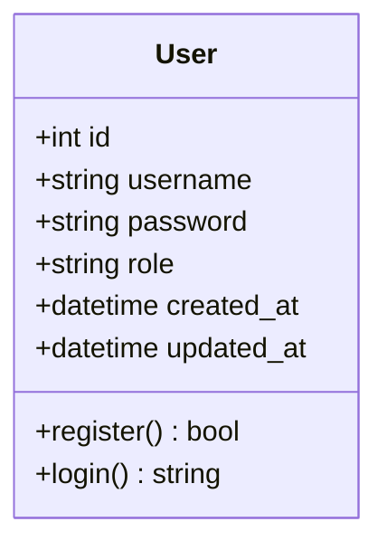

### 1.2 Dịch Vụ Sản Phẩm (product-service Context)
Lưu trữ thông tin chi tiết về sản phẩm. Đặc biệt sử dụng thiết kế phân cấp loại hình hàng hóa chuyên biệt thông qua liên kết `One-to-One` nối dài từ thực thể sản phẩm chung sang các bảng đặc tả tên miền (`domain`).

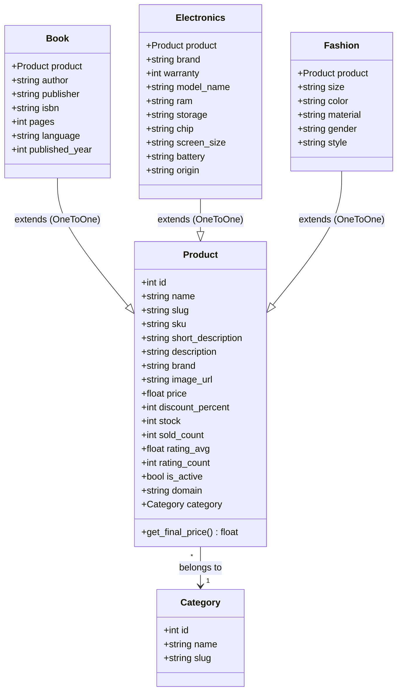

### 1.3 Dịch Vụ Giỏ Hàng (cart-service Context)
Thực hiện các thao tác tạm thời liên quan đến việc chọn lọc hàng hóa của người dùng trước khi tiến hành thanh toán.

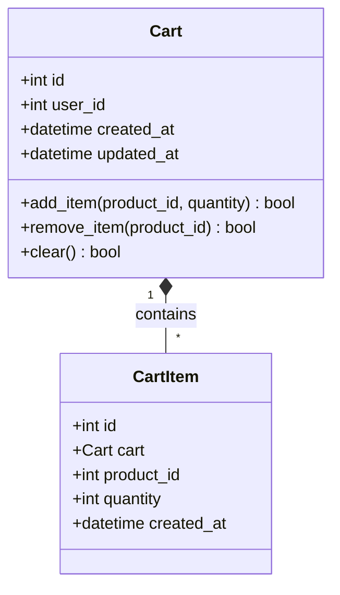

### 1.4 Dịch Vụ Đơn Hàng (order-service Context)
Quản lý toàn bộ vòng đời của đơn hàng trong hệ thống. Cung cấp bộ lọc đơn hàng theo vai trò thực hiện (Admin & Staff được quyền xem toàn bộ hệ thống đơn hàng, khách hàng thường chỉ thấy đơn hàng của chính mình).

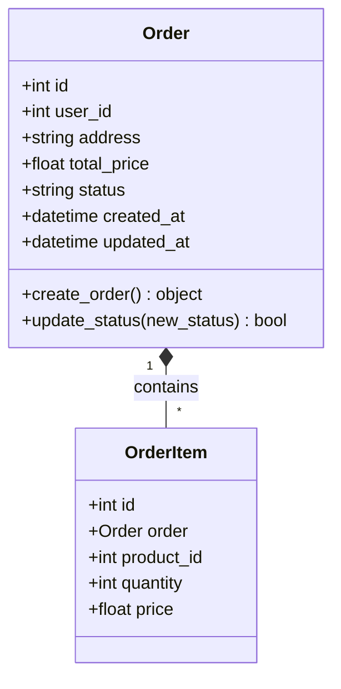

### 1.5 Dịch Vụ Thanh Toán (payment-service Context)
Đảm nhận việc xử lý dòng tiền thông qua các cổng thanh toán tích hợp (COD, Momo, Thẻ ngân hàng).

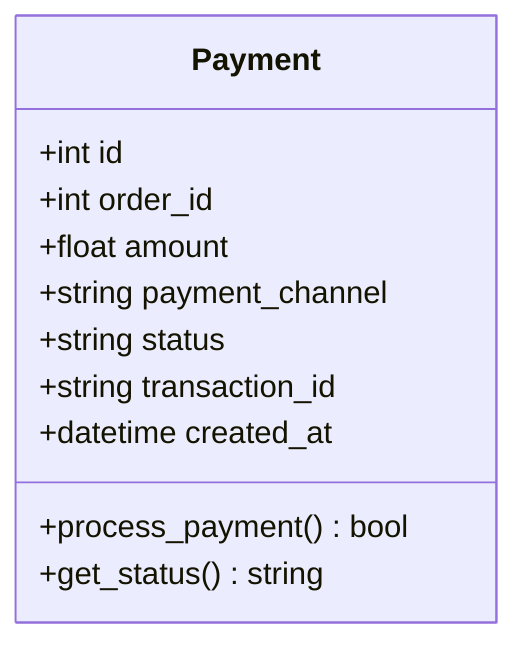

### 1.6 Dịch Vụ Giao Hàng (shipping-service Context)
Giám sát và cập nhật lộ trình di chuyển của hàng hóa sau khi được bộ phận Staff phê duyệt xuất kho.

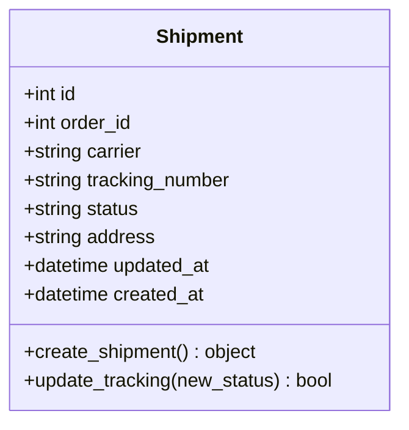

### 1.7 Dịch Vụ Trí Tuệ Nhân Tạo (ai-service Context)
Động cơ AI lai thông minh (Hybrid AI Engine), kết hợp mô hình học sâu LSTM xử lý chuỗi hành vi, cơ sở dữ liệu đồ thị Neo4j kết nối các điểm nút liên quan và cơ chế tìm kiếm ngữ nghĩa FAISS RAG phục vụ tư vấn trực tiếp.

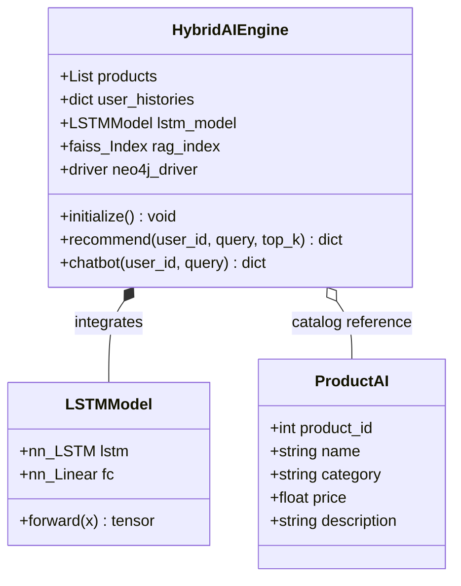

---

## 2. BIỂU ĐỒ TUẦN TỰ (SEQUENCE DIAGRAMS) CHO CÁC LUỒNG CHỨC NĂNG CHÍNH

Dưới đây là 4 luồng nghiệp vụ cốt lõi thể hiện sự tương tác thời gian thực giữa các thành phần trong hệ thống QuickMall từ Client đến các lớp Database.

### Luồng 1: Đăng ký & Đăng nhập Hệ thống (Authentication Flow)
Mô tả tiến trình xác thực thông tin tài khoản và phân phối JWT token dựa trên vai trò để định tuyến giao diện người dùng.

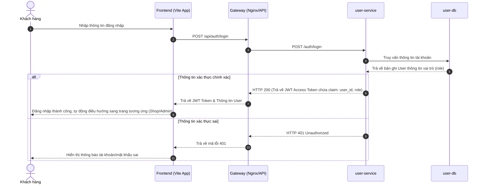

### Luồng 2: Mua sắm & Thêm Giỏ Hàng (Shopping & Add to Cart)
Mô tả cách thức người dùng tìm kiếm sản phẩm và thêm vào giỏ hàng cá nhân lưu trữ trong MySQL độc lập.

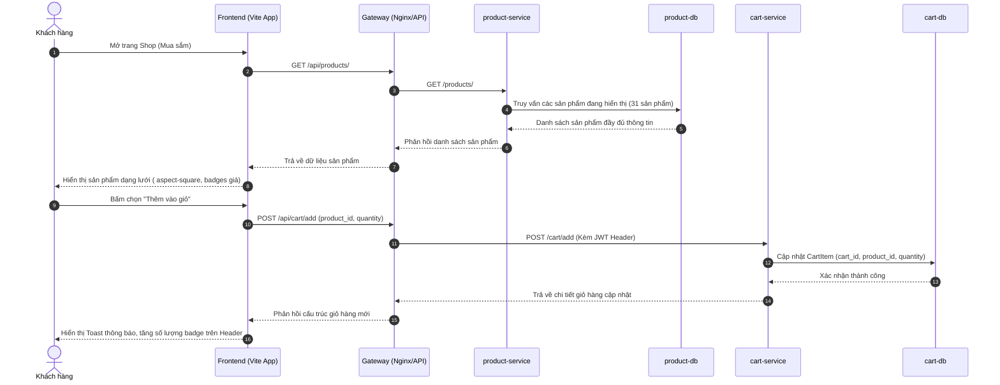

### Luồng 3: Thanh toán & Xử lý Đơn hàng (Checkout & Fulfillment)
Tiến trình giao dịch mua bán, xử lý tự động chuỗi thanh toán, giao nhận, và cơ chế phê duyệt trạng thái từ vai trò Staff.

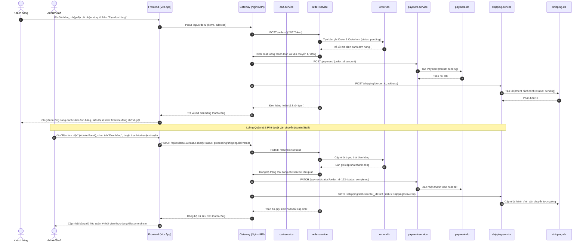

### Luồng 4: Gợi ý Cá nhân hóa & Trò chuyện Chatbot AI (AI Recommendation & Chatbot)
Quy trình động cơ AI Service phối hợp FAISS RAG, mạng LSTM hành vi và cơ sở dữ liệu đồ thị Neo4j để đưa ra đề xuất chính xác tuyệt đối, loại bỏ hoàn toàn hiện tượng lệch danh mục ngành hàng.

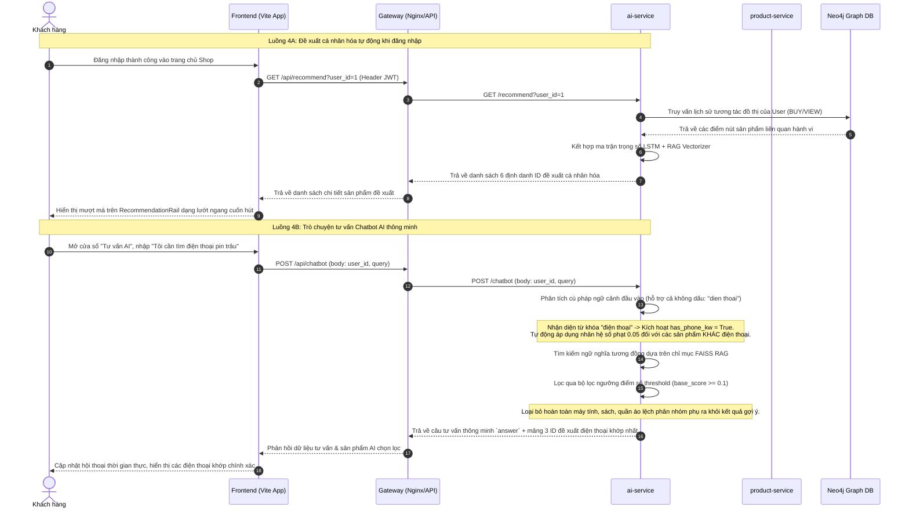

---

### Luồng 5: Quản lý Kho & Cập nhật Sản phẩm (Product Stock Management Flow)
Mô tả quy trình Admin hoặc Staff cập nhật giá bán hoặc số lượng hàng dự trữ trực tiếp trên giao diện Bàn làm việc để đồng bộ tức thời xuống `product-service`.

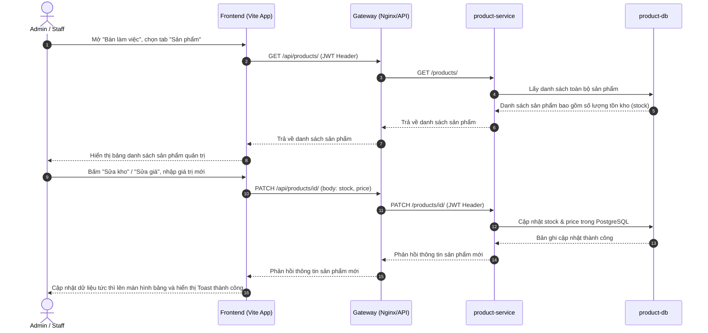

### Luồng 6: Phê duyệt & Xử lý Đơn hàng (Order Fulfillment Flow - Admin/Staff)
Tiến trình Staff/Admin xem toàn bộ đơn hàng của mọi người dùng trong hệ thống (thông qua phân quyền JWT role claim) và cập nhật trạng thái đơn hàng (duyệt thanh toán, giao vận chuyển, hoàn tất).

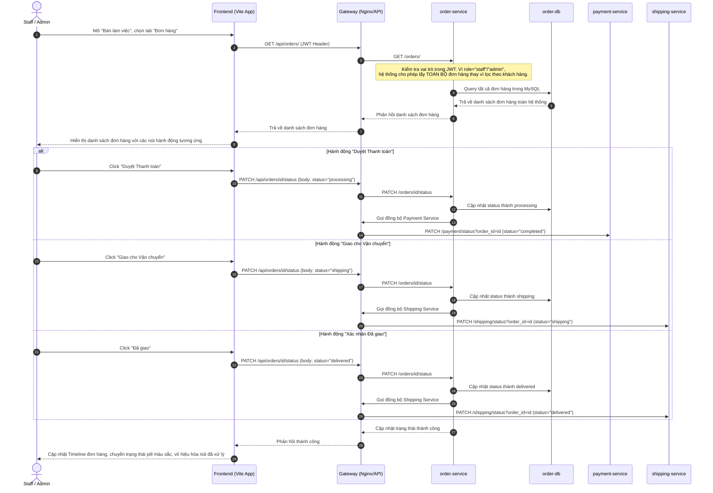

### Luồng 7: Tra cứu Danh bạ Người dùng (User Directory Flow - Admin Only)
Quy trình bảo mật chỉ cho phép tài khoản có vai trò `admin` xem danh sách toàn bộ các tài khoản người dùng đang đăng ký trong hệ thống, khóa chặt các vai trò có quyền hạn thấp hơn (`staff`, `customer`).

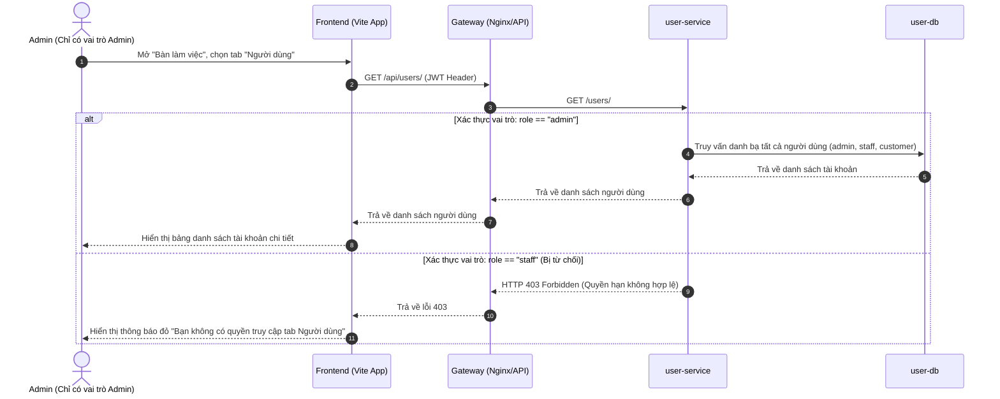

---

## 3. HƯỚNG DẪN TÍCH HỢP VÀ HIỂN THỊ
Để biểu đồ hiển thị một cách đẹp mắt nhất trong tài liệu Markdown này:
1. Bạn có thể sử dụng các trình xem Markdown hỗ trợ Mermaid (như VS Code Markdown Preview, GitHub, Notion).
2. Mã nguồn biểu đồ tuân thủ tiêu chuẩn Mermaid phiên bản mới nhất, sử dụng các ký hiệu liên kết phân cấp trực quan và dễ dàng bảo trì.
